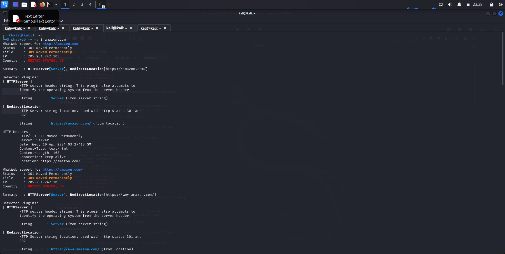

# InformationGathering
Information Gathering Techiques

# To perform information gathering techniques

# AIM:

To perform information gathering techniques using kali linux 

## STEPS:

### Step 1:

Install kali linux either in partition or virtual box or in live mode

### Step 2:

Investigate on the various categories of tools as follows:

### Step 3:
Open terminal/browser and try execute necessary commands/use url to perform information gathering

## Pen Test Tools Categories:  

#### Following Categories of pen test tools are identified for information gathering:

Footprinting is a part of the reconnaissance process which is used for gathering possible information about a target computer system or network.

# OUTPUT:
http://www.whois.com/whois website to get detailed information about a domain name information including its owner, its registrar, date of registration, expiry, name server, owner's contact information, etc.

#### Finding IP address:
ping command is available on Windows as well as on Linux OS. Following is the example of find out the IP address of amazon.com.

#### Finding Hosting Company:
get further detail by using ip2location.com website.

#### History of the website:

https://web.archive.org/

## Webserver Fingeprinting:
### Netcat:

sudo nc 172.17.52.118  80
GET / HTTP/1.1
Host: amazon.com

# InformationGathering
Information Gathering Techiques

# To perform information gathering techniques

# AIM:

To perform information gathering techniques using kali linux 

## STEPS:

### Step 1:

Install kali linux either in partition or virtual box or in live mode

### Step 2:

Investigate on the various categories of tools as follows:

### Step 3:
Open terminal/browser and try execute necessary commands/use url to perform information gathering

## Pen Test Tools Categories:  

#### Following Categories of pen test tools are identified for information gathering:

Footprinting is a part of the reconnaissance process which is used for gathering possible information about a target computer system or network.

# OUTPUT:
http://www.whois.com/whois website to get detailed information about a domain name information including its owner, its registrar, date of registration, expiry, name server, owner's contact information, etc.

#### Finding IP address:
ping command is available on Windows as well as on Linux OS. Following is the example of find out the IP address of amazon.com.

#### Finding Hosting Company:
get further detail by using ip2location.com website.

#### History of the website:

https://web.archive.org/

## Webserver Fingeprinting:
### Netcat:

sudo nc 172.17.52.118  80
GET / HTTP/1.1
Host: amazon.com

### nmap:

### Whatweb:

### httprint:

### Tracing the Location
#### TCP Traceroute: 
sudo traceroute -T amazon.com

#### UDP Traceroute:
sudo traceroute -U amazon.com
 

#### ICMP Traceroute:
sudo traceroute amazon.com

## RESULT:
The information gathering techniques tools/procedure were  identified successfully